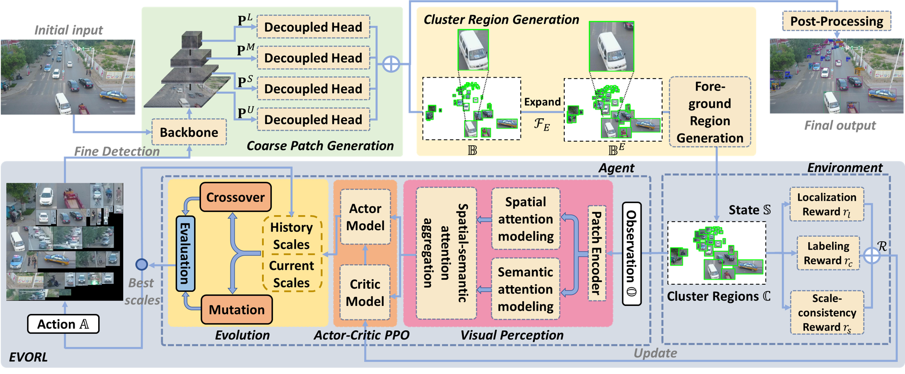

# Scale Optimization Using Evolutionary Reinforcement Learning for Object Detection on Drone Imagery

### Coming Soon ...

###  [Paper]() | [🤗Demo🔥]( )   

Jialu Zhang1,3, Xiaoying Yang1, Wentao He1, Jianfeng Ren1,2 (Corresponding author), Qian Zhang1,2, Yitian Zhao3, Ruibin Bai1,2, Xiangjian He1,2, Jiang Liu3,4

- 1The Digital Port Technologies Lab, School of Computer Science, University of Nottingham Ningbo China
- 2Nottingham Ningbo China Beacons of Excellence Research and Innovation Institute, University of Nottingham Ningbo China
- 3Cixi Institute of Biomedical Engineering, Chinese Academy of Sciences
- 4Department of Computer Science and Engineering, Southern University of Science and Technology

Emails:

- {sgxjz1, scxxy1, scxwh1, jianfeng.ren, qian.zhang, ruibin.bai, sean.he}@nottingham.edu.cn
- yitian.zhao@nimte.ac.cn
- liuj@sustech.edu.cn

### 

Abstract

Object detection in aerial imagery presents a significant challenge due to large scale variations among objects. This paper proposes an evolutionary reinforcement learning agent, integrated within a coarse-to-fine object detection framework, to optimize the scale for more effective detection of objects in such images. Specifically, a set of patches potentially containing objects are first generated. A set of rewards measuring the localization accuracy, the accuracy of predicted labels, and the scale consistency among nearby patches are designed in the agent to guide the scale optimization. The proposed scale-consistency reward ensures similar scales for neighboring objects of the same category. 
Furthermore, a spatial-semantic attention mechanism is designed to exploit the spatial semantic relations between patches. The agent employs the proximal policy optimization strategy in conjunction with the evolutionary strategy, effectively utilizing both the current patch status and historical experience embedded in the agent.  The proposed model is compared with state-of-the-art methods on two benchmark datasets for object detection on drone imagery. It significantly outperforms all the compared methods. 
